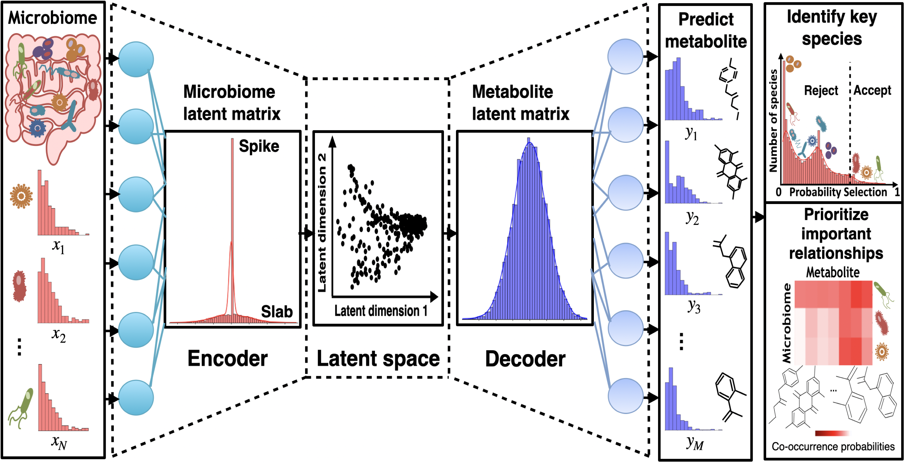
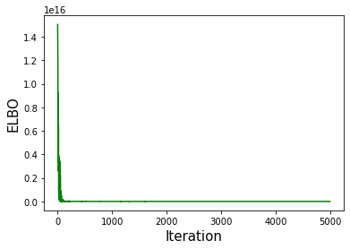
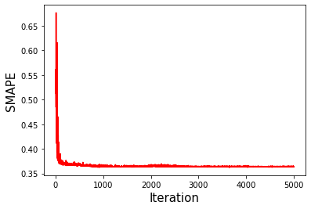
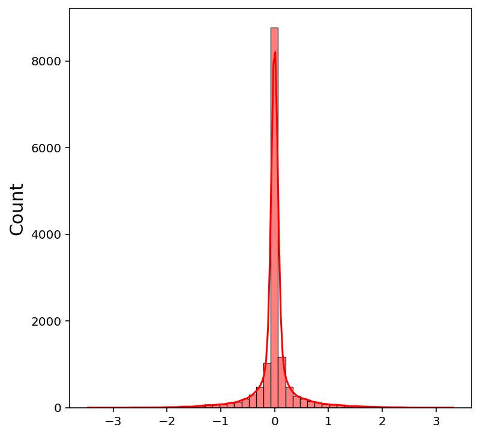
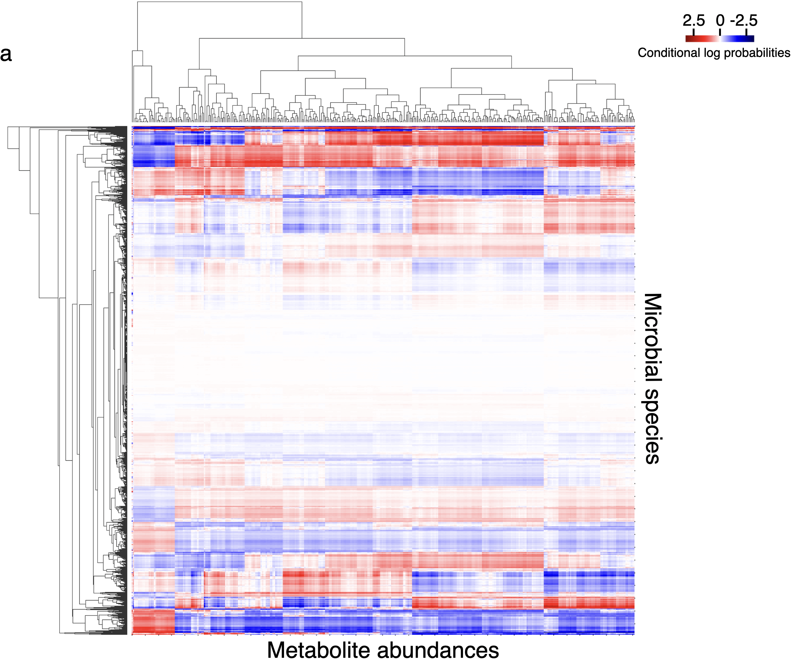
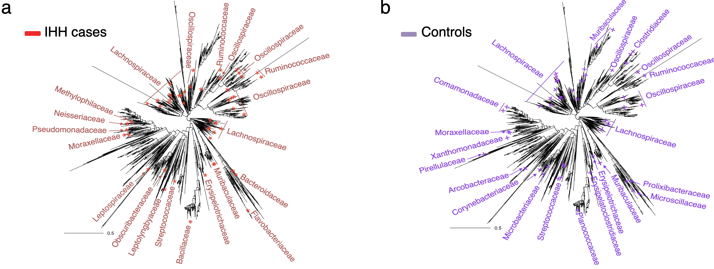
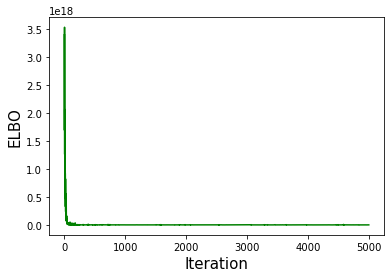
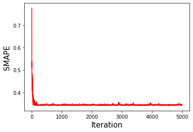
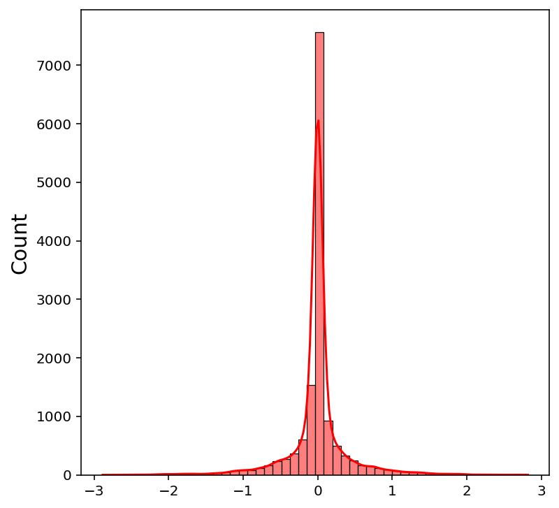
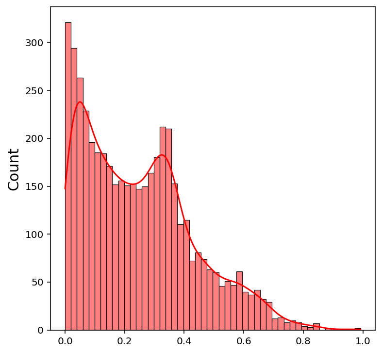

# VBayesMM: Variational Bayesian microbiome multiomics

## Publication
Tung Dang, Artem Lysenko, Keith A. Boroevich and Tatsuhiko Tsunoda, VBayesMM: variational Bayesian neural network to prioritize important relationships of high-dimensional microbiome multiomics data, Briefings in Bioinformatics, Volume 26, Issue 4, July 2025 | [https://doi.org/10.1093/bib/bbaf300](https://doi.org/10.1093/bib/bbaf300)


## The workflow of VBayesMM



## Data

- The obstructive sleep apnea (OSA) in mice (dataset A). 16S rRNA gene sequencing-based microbiome and liquid chromatography-tandem mass spectrometry (LC-MS/MS)-based metabolome are obtained from [Haddad_osa github repo](https://github.com/knightlab-analyses/haddad_osa/).
- The high-fat diet (HFD) in a murine model (dataset B). 16S rRNA gene sequencing-based microbiome and liquid chromatography-tandem mass spectrometry (LC-MS/MS)-based metabolome are obtained from [Multiomic-cooccurences github repo](https://github.com/knightlab-analyses/multiomic-cooccurrences). 
- The astric cancer (GC) patients (dataset C) and colorectal cancer (CRC) patients from stage 0 to stage 4 (dataset D). Whole-genome shotgun sequencing (WGS) microbiome profiling and capillary electrophoresis time-of-flight mass spectrometry (CE-TOFMS) for metabolomics are obtained from [Microbiome-metabolome curated data github repo](https://github.com/borenstein-lab/microbiome-metabolome-curated-data/wiki).  

## Quick start
### TensorFlow
- Import packages 
```
import pandas as pd
import numpy as np
import matplotlib.pyplot as plt
import seaborn as sns
import biom
from biom import load_table, Table
from scipy.stats import entropy, spearmanr
from scipy.sparse import coo_matrix

import tensorflow as tf
from VBayesMM import VBayesMM
```

- Loading and preparing data in  ```examples/ ```
  
  Let us first load the simple sample data to see an example of the VBayesMM. VBayesMM supports for loading arbitrary ```biom```, ```tsv```, and ```csv```
  
```
microbes = load_table("microbes.biom")
metabolites = load_table("metabolites.biom")
microbes_df = microbes.to_dataframe()
metabolites_df = metabolites.to_dataframe()

microbes_df = microbes_df.astype(pd.SparseDtype("float64",fill_value=0))
metabolites_df = metabolites_df.astype(pd.SparseDtype("float64",fill_value=0))

microbes_df, metabolites_df = microbes_df.align(metabolites_df, axis=0, join='inner')

num_test = 20

sample_ids = set(np.random.choice(microbes_df.index, size=num_test))
sample_ids = np.array([(x in sample_ids) for x in microbes_df.index])

train_microbes_df = microbes_df.loc[~sample_ids]
test_microbes_df = microbes_df.loc[sample_ids]
train_metabolites_df = metabolites_df.loc[~sample_ids]
test_metabolites_df = metabolites_df.loc[sample_ids]

train_microbes_coo = coo_matrix(train_microbes_df.values)
test_microbes_coo = coo_matrix(test_microbes_df.values)
```

- Creating, training, and testing a model

```
model = VBayesMM()

config = tf.compat.v1.ConfigProto()

with tf.Graph().as_default(), tf.compat.v1.Session(config=config) as session:
    model(session, train_microbes_coo, train_metabolites_df.values,
          test_microbes_coo, test_metabolites_df.values)
    ELBO, _, SMAPE = model.fit(epoch=5000) 
```
| Train data | Test data | 
| ----------------------------------- |:---------------------------------------------:|
| || 

- Visualizing the posterior distributions of model outputs

```
latent_microbiome_matrix = model.U

microbial_species_selection = model.U_mean_gamma
microbial_species_selection_mean = np.sort(np.mean(microbial_species_selection, axis=1))[::-1]
```
| Latent microbiome matrix | Microbial species selection | 
| ----------------------------------- |:---------------------------------------------:|
| || 

- Visualizing the estimated conditional log probabilities of microbial species and metabolite abundances
```
Umain = model.U
Ubias = model.Ubias
Vmain = model.V
Vbias = model.Vbias

U_microbiome = np.hstack(
    (np.ones((Umain.shape[0],1)),
     Ubias.reshape(-1,1), Umain))

V_metabolite = np.vstack(
    (Vbias.reshape(1,-1),
     np.ones((1,Vmain.shape[1])), Vmain))

ranks = pd.DataFrame(clr(centralize(clr_inv(np.hstack(
    (np.zeros((Umain.shape[0], 1)), U_microbiome @ V_metabolite))))),
    index=train_microbes_df.columns,
    columns=train_metabolites_df.columns)

plt.figure(figsize=(50, 50))
g = sns.clustermap(ranks, cmap='seismic', center=0, z_score=1)
g.ax_heatmap.set_xticklabels([])
g.ax_heatmap.set_yticklabels([])
g.ax_heatmap.set_xlabel("")
g.ax_heatmap.set_ylabel("")
plt.show()
```


- Visualizing the microbial species selected using the VBayesMM mapped on the phylogenetic tree

```
library(phyloseq)
library(phytools)
library(ape)
library(dplyr)
library(tidyr)
library(stringi)
library(stringr)


load("examples/datasetA/OSA_tree_filtered.RData")
load("examples/datasetA/OSA_phylo_filtered.RData")

plot(ladderize(osa_tree_new), show.tip.label = F, use.edge.length = T,show.node.label=FALSE,
     direction="downwards", cex = 0.8, type = "fan", label.offset = 0.05)
otu_full <- osa_tree_new$tip.label

osa <- read.csv("examples/datasetA/Microbiome_OSA_data_processed.csv")
osa_air <- read.csv("examples/datasetA/OSA_AIR_top50.csv")
osa_ihh <- read.csv("examples/datasetA/OSA_IHH_top50.csv")

osa_air <- osa_air %>% subset(X != "X0")
osa_ihh <- osa_ihh %>% subset(X != "XO")
rownames(osa) <- osa$X.OTU.ID
rownames(osa_air) <- osa_air$X
rownames(osa_ihh) <- osa_ihh$X
otu_air <- osa %>% subset(rownames(osa) %in% rownames(osa_air))
otu_ihh <- osa %>% subset(rownames(osa) %in% rownames(osa_ihh))

otu_0 <- otu_air$ID
otu_1 <- otu_ihh$ID

edge_full <- osa_tree_new$edge

osa_full_new <- osa_tree_new
otu_sub_0_in_otu_full <- otu_full %in% otu_0
otu_sub_1_in_otu_full <- otu_full %in% otu_1

otu_full_0 <- rep("", length(otu_full))
otu_full_0[otu_sub_0_in_otu_full] <- rep("+", sum(otu_sub_0_in_otu_full))
otu_full_0[otu_sub_1_in_otu_full] <- rep("*", sum(otu_sub_1_in_otu_full))

osa_full_new$tip.label <- otu_full_0

# IHH cases
tipcol <- rep("black", length(osa_full_new$tip.label))
for (i in 1:length(osa_full_new$tip.label)) {
  if (osa_full_new$tip.label[i] == "*") {
    tipcol[i] <- "red"
  } 
}
plot(ladderize(osa_full_new), type =  "fan", label.offset = 0.05,
     show.tip.label = T, cex = 2, tip.color = tipcol)
add.scale.bar()

# Controls group
tipcol <- rep("black", length(osa_full_new$tip.label))
for (i in 1:length(osa_full_new$tip.label)) {
  if (osa_full_new$tip.label[i] == "+") {
    tipcol[i] <- "purple"
  } 
}
plot(ladderize(osa_full_new), type =  "fan", label.offset = 0.05,
     show.tip.label = T, cex = 2, tip.color = tipcol)
add.scale.bar()

```


### PyTorch
- Import packages

```
import pandas as pd
import numpy as np
import matplotlib.pyplot as plt
import seaborn as sns
import biom
from biom import load_table, Table
from scipy.stats import entropy, spearmanr
from scipy.sparse import coo_matrix

import torch
from VBayesMM import VBayesMM
```

- Loading and preparing data

```
microbes = load_table("microbes.biom")
metabolites = load_table("metabolites.biom")
microbes_df = microbes.to_dataframe()
metabolites_df = metabolites.to_dataframe()

microbes_df = microbes_df.astype(pd.SparseDtype("float64",fill_value=0))
metabolites_df = metabolites_df.astype(pd.SparseDtype("float64",fill_value=0))
microbes_df, metabolites_df = microbes_df.align(metabolites_df, axis=0, join='inner')

num_test = 20

sample_ids = set(np.random.choice(microbes_df.index, size=num_test))
sample_ids = np.array([(x in sample_ids) for x in microbes_df.index])

train_microbes_df = microbes_df.loc[~sample_ids]
test_microbes_df = microbes_df.loc[sample_ids]
train_metabolites_df = metabolites_df.loc[~sample_ids]
test_metabolites_df = metabolites_df.loc[sample_ids]

n, d1 = train_microbes_df.shape
n, d2 = train_metabolites_df.shape

train_microbes_coo = coo_matrix(train_microbes_df.values)
test_microbes_coo = coo_matrix(test_microbes_df.values)
trainY_torch = torch.tensor(train_metabolites_df.to_numpy(), dtype=torch.float32)
testY_torch = torch.tensor(test_metabolites_df.to_numpy(), dtype=torch.float32)
```

- Creating, training, and testing a model

```
model = VBayesMM(d1=d1, d2=d2, num_samples=n)
ELBO, _, SMAPE = model.fit(train_microbes_coo, trainY_torch, test_microbes_coo, testY_torch, epochs=5000)
```
| Train data | Test data | 
| ----------------------------------- |:---------------------------------------------:|
| || 

- Visualizing the posterior distributions of model outputs

```
latent_microbiome_matrix = np.array(model.qUmain_mean.weight.data.detach())

microbial_species_selection = np.array(model.qUmain_mean_gamma.detach())
microbial_species_selection_mean = np.sort(np.mean(microbial_species_selection, axis=1))[::-1]
```
| Latent microbiome matrix | Microbial species selection | 
| ----------------------------------- |:---------------------------------------------:|
| || 


## Directory structure

### Source code

All of the code is in the ```src/``` folder, you can use to re-make the analyses in the paper:

- ```tensorflow/VBayesMM.py```: file contains Python codes for VBayesMM method for TensorFlow User.
- ```pytorch/VBayesMM.py```: file contains Python codes for VBayesMM method for PyTorch User.

If you have any problem, please contact me via email: dangthanhtung91@vn-bml.com
