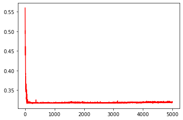

# VBayesMM: Variational Bayesian microbiome multiomics

## Publication
Tung Dang, Artem Lysenko and Tatsuhiko Tsunoda. "VBayesMM: Variational Bayesian neural network to prioritize important relationships of high-dimensional microbiome multiomics data" 


## The workflow of VBayesMM


## Quick start

- Import packages 
```
import pandas as pd
import numpy as np
import matplotlib.pyplot as plt
import seaborn as sns
import biom
from biom import load_table, Table
from scipy.stats import entropy, spearmanr
from scipy.sparse import coo_matrix

import tensorflow as tf
from VBayesMM import VBayesMM
```

- Loading and preparing data in  ```examples/ ```
  
  Let us first load a subsampled version of the obstructive sleep apnea (OSA) in mice dataset described in Tripathi et al. (2018). VBayesMM supports for loading arbitrary ```csv```, ```tsv```, and ```biom```
  
```
microbes = load_table("microbes.biom")
metabolites = load_table("metabolites.biom")
microbes_df = microbes.to_dataframe()
metabolites_df = metabolites.to_dataframe()

microbes_df = microbes_df.astype(pd.SparseDtype("float64",fill_value=0))
metabolites_df = metabolites_df.astype(pd.SparseDtype("float64",fill_value=0))

microbes_df, metabolites_df = microbes_df.align(metabolites_df, axis=0, join='inner')

num_test = 20

sample_ids = set(np.random.choice(microbes_df.index, size=num_test))
sample_ids = np.array([(x in sample_ids) for x in microbes_df.index])

train_microbes_df = microbes_df.loc[~sample_ids]
test_microbes_df = microbes_df.loc[sample_ids]
train_metabolites_df = metabolites_df.loc[~sample_ids]
test_metabolites_df = metabolites_df.loc[sample_ids]

train_microbes_coo = coo_matrix(train_microbes_df.values)
test_microbes_coo = coo_matrix(test_microbes_df.values)
```

- Creating and training a model

```
model = VBayesMM()

config = tf.compat.v1.ConfigProto()

with tf.Graph().as_default(), tf.compat.v1.Session(config=config) as session:
    model(session, train_microbes_coo, train_metabolites_df.values,
          test_microbes_coo, test_metabolites_df.values)
    ELBO, MAE, SMAPE = model.fit(epoch=5000) 
```
| Train data | Test data | 
| ----------------------------------- |:---------------------------------------------:|
| || 

## Directory structure

### Data

- The obstructive sleep apnea (OSA) in mice (dataset A). 16S rRNA gene sequencing-based microbiome and liquid chromatography-tandem mass spectrometry (LC-MS/MS)-based metabolome are obtained from [Haddad_osa github repo](https://github.com/knightlab-analyses/haddad_osa/).
- The high-fat diet (HFD) in a murine model (dataset B). 16S rRNA gene sequencing-based microbiome and liquid chromatography-tandem mass spectrometry (LC-MS/MS)-based metabolome are obtained from [Multiomic-cooccurences github repo](https://github.com/knightlab-analyses/multiomic-cooccurrences). 
- The astric cancer (GC) patients (dataset C) and colorectal cancer (CRC) patients from stage 0 to stage 4 (dataset D). Whole-genome shotgun sequencing (WGS) microbiome profiling and capillary electrophoresis time-of-flight mass spectrometry (CE-TOFMS) for metabolomics are obtained from [Microbiome-metabolome curated data github repo](https://github.com/borenstein-lab/microbiome-metabolome-curated-data/wiki).  

### Source code

All of the code is in the ```src/``` folder, you can use to re-make the analyses in the paper:

- ```tensorflow/VBayesMM.py```: file contains Python codes for VBayesMM method for TensorFlow User.
- ```pytorch/VBayesMM.py```: file contains Python codes for VBayesMM method for PyTorch User.

If you have any problem, please contact me via email: dangthanhtung91@vn-bml.com
